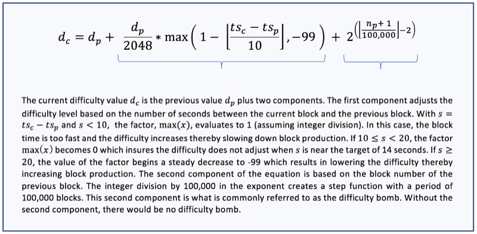

```{r setup, include=FALSE}
knitr::opts_chunk$set(echo = TRUE, message = FALSE, warning = FALSE)

library(tidyverse)
library(scales)
library(knitr)
```

## INTRODUCTION

Like other cryptocurrency networks, Ethereum relies on a consensus  mechanism which mainly uses large amount of energy and computational power, that encourages scalability and centralization of the technology into large mining farms created by individuals or groups with significant assets. however, this centralization goes against the original tenets behind cryptocurrency.

Ethereum's "difficulty bomb" simply refers to the intentional and sudden increase in mining difficulty that will occur when ETH 2.0 and PoW updates is released to the Ethereum network.
Why difficulty bomb? it's simple. it's main intent is to exponentially increase the amount of time it takes to mine a new block on the Ethereum blockchain such that it:

a. Encourages crypto miners to move away from energy -intensive PoW mining by removing the Incentives.
b. Takes away the ability to centralize currency creation and ownership
c. Discourage blockchain forks, and
d. Force node upgrades.
        
## AIM OF ANALYZING THE DIFFICULTY BLOCK

The main goal is to possibly predict (identify) when the bomb will explode (possibly how far back to set thte bomb too). in his article "Adventure in difficulty bombing", Thomas Jay Rush (TjayRush) performed an exercise in predicting the effect of EIP4345. he gave two parts to the difficulty calculation based on his other article "It's not too difficult". these are, Part A (for adjustment) snd Part B (for bomb), as shown in the diagram below. 



```{r}
#------------------------------------------------------------
# sugar for some named blocks
bn.HOMESTEAD       <- 1150000

bn.BYZANTIUM       <- 4370000
ts.BYZANTIUM       <- 1508131331
off.BYZANTIUM      <- 3000000

bn.CONSTANTINOPLE  <- 7280000
ts.CONSTANTINOPLE  <- 1551383524
off.CONSTANTINOPLE <- off.BYZANTIUM + 2000000

bn.ISTANBUL        <- 9069000
ts.ISTANBUL        <- 1575764709

bn.MUIRGLACIER     <- 9200000
ts.MUIRGLACIER     <- 1577953849
off.MUIRGLACIER    <- off.CONSTANTINOPLE + 4000000

bn.BERLIN          <- 12244000
ts.BERLIN          <- 1618481223

bn.LONDON          <- 12965000
ts.LONDON          <- 1628166822
off.LONDON         <- off.MUIRGLACIER + 700000

bn.ARROW           <- 13773000
ts.ARROW           <- 1639022046
off.ARROW          <- off.LONDON + 1000000

# some constants
const.BIN_SIZE     <- 200
const.PERIOD_SIZE  <- 100000
const.SAMPLE_SIZE  <- 50000
const.DANGER_ZONE  <- 38

#------------------------------------------------------------
# read in the data (blocknumber,timestamp,difficulty), removing blocks prior to HOMESTEAD
#
# block.bin  - puts blocks in bukcets of width BIN_SIZE
# block.fake - the fake block number as per the difficulty calc
# period     - the difficulty bomb's current period (relative to block.fake)
# bomb       - the actual bomb's value at the block
df <- read_csv('store/difficulty.csv') %>%
  #  filter(blocknumber >= bn.HOMESTEAD) %>%
  mutate(block.bin = floor(blocknumber / const.BIN_SIZE) * const.BIN_SIZE) %>%
  mutate(fake.block =
           ifelse(blocknumber >= bn.ARROW,
                  blocknumber - off.ARROW,
                  ifelse(blocknumber >= bn.LONDON,
                         blocknumber - off.LONDON,
                         ifelse(blocknumber >= bn.MUIRGLACIER,
                                blocknumber - off.MUIRGLACIER,
                                ifelse(blocknumber >= bn.CONSTANTINOPLE,
                                       blocknumber - off.CONSTANTINOPLE,
                                       ifelse(blocknumber >= bn.BYZANTIUM,
                                              blocknumber - off.BYZANTIUM,
                                              blocknumber) + 1
                                             )
                                       )
                               )
                        )
                  ) %>%
  mutate(period = floor(fake.block / const.PERIOD_SIZE)) %>%
  mutate(period.scaled = period * 100000) %>%
  mutate(bomb = 2 ^ period) %>%
  
  mutate(parent.difficulty = lag(difficulty)) %>%
  mutate(parent.ts = lag(timestamp)) %>%
  
  mutate(diff.delta = parent.difficulty - difficulty) %>%
  mutate(ts.delta = parent.ts - timestamp) %>%
  
  mutate(diff.sensitivity = diff.delta / difficulty) %>%
  mutate(ts.sensitivity = ts.delta / timestamp) %>%
  
  mutate(era =
           ifelse(blocknumber <= bn.BYZANTIUM,
                  'timeframe 1 (pre-byzantium)',
                  ifelse(blocknumber <= bn.MUIRGLACIER,
                         'timeframe 2 (post-byzantium)',
                         ifelse(blocknumber <= bn.LONDON,
                                'timeframe 3 (post-muir)',
                                ifelse(blocknumber <= bn.ARROW,
                                       'timeframe 3 (post-london)',
                                       'timeframe 4 (post-arrow)'
                                )
                         )
                  )
           )
     )
```

The article opined that the adjustment part is the every-block adjustment that keeps blocks time hovering around 13.5seconds and that the bomb or part B is a step-function that doubles every 100,000 blocks. (further readings can be found here https://medium.com/coinmonks/adventures-in-difficulty-bombing-837890476630)

The dataset used consists of >1million rows and 3 columns. These columns are listed below:

a. blocknumber
b. timestamp, and
c. difficulty. 
   
A sample of the raw data within the R-analysis environment is shown in the table below.

```{r}
# sample the data otherwise it's too big
sample <- df %>% sample_frac(.005) %>% arrange(blocknumber)  # TODO: Potentially update this because random sampling doesn't produce a consistent time interval

# group by block bin
blockBinSample <- sample %>% group_by(block.bin)

head(sample) %>% kable
```

The code section started off with some named blocks, e.g homestead and byzantium. The the full sample_size was set to 50000 (this correlate to how the fake_block is been calculated, with fake_block = real_block -(fork_block -50,000). The period_size is set at 100,000 while the danger_zone is set at 38. variable names and constants used in the code is as above, with present time (period) indicated.

Data was read in, blocks Prior to Homestead removed, additional columns were formulated, viz; block_bin, block_fake, period, bomb, parent.difficulty, difficulty_sensitivity, and so on. 

The first chart in the code indicates the block number/fake block number/ bomb period.

NB: three iterated epoch of the codes with its graphical visualizations will be posted in this report.

```{r, fig.width=8}
latest <- max(sample$timestamp)
curFake <- tail(sample$fake.block, n=1)
latestPeriod <- floor(curFake / 100000)

#------------------------------------------------------------
chart_title <- "Block Number / Fake Block Number / Bomb Period"
x_vals <- sample$timestamp
x_label <- "Date"
y_vals <- sample$block.bin
y_label <- "Real / Fake BN"
anno1.text <- "Source: Ethereum mainnet"
anno1.x.pct = .15
anno1.y.pct = .01
anno2.text <- "Produced for Tokenomics™ by TrueBlocks, LLC"
anno2.x.pct = .35
anno2.y.pct = .99
source(file="../common/chart_defaults.R")
#------------------------------------------------------------
fakeBlock <- blockBinSample %>%
  ungroup() %>%
  ggplot(aes(x = timestamp, cey.lab = 1)) +
  geom_line(aes(y = block.bin,  color='blocknumber')) +
  geom_line(aes(y = fake.block, color='fake.block')) +
  geom_line(aes(y = period.scaled, color='period')) +
  geom_hline(yintercept = (const.DANGER_ZONE * 100000), color="darkgray", linetype="dashed") +
  geom_vline(xintercept = ts.BYZANTIUM, color="lightgray", linetype="dashed") +
  annotate("label", x = ts.BYZANTIUM, y = 10000000, label = "Byzantium", size=3) +
  geom_vline(xintercept = ts.CONSTANTINOPLE, color="lightgray", linetype="dashed") +
  annotate("label", x = ts.CONSTANTINOPLE, y = 10000000, label = "Constantinople", size=3) +
  geom_vline(xintercept = ts.ISTANBUL, color="lightgray", linetype="dashed") +
  annotate("label", x = ts.ISTANBUL, y = 10000000, label = "Istanbul", size=3) +
  geom_vline(xintercept = ts.MUIRGLACIER, color="lightgray", linetype="dashed") +
  annotate("label", x = ts.MUIRGLACIER, y = 10000000, label = "Muirglacier", size=3) +
  geom_vline(xintercept = ts.BERLIN, color="lightgray", linetype="dashed") +
  annotate("label", x = ts.BERLIN, y = 8000000, label = "Berlin", size=3) +
  geom_vline(xintercept = ts.LONDON, color="lightgray", linetype="dashed") +
  annotate("label", x = ts.LONDON, y = 10000000, label = "London", size=3) +
  geom_vline(xintercept = latest, color="blue", linetype="dashed") +
  labels + anno1 + anno2 +
  theme + xaxis + yaxis
fakeBlock
```

The real(true) block number is indicated with the red line above, with its range from 0 to >10,000,000. The green line which indicates the fake block number tracks the real block number until when it somewhat resets at just above the 4,000,000 blocks. it turns to a downhill (parallel) to the true blocks till it resets at about <1,000,000 blocks. Here, the reset seem to happen at a constant block number, just below the 4,000,000 block.
Note: the three graphs above was drawn using same scale and the outputs are identical.

The second chart in the code indicates the difficulty and difficulty bomb per block. 

```{r, fig.height=7}
#------------------------------------------------------------
chart_title <- "Difficulty and Difficulty Bomb per Block"
x_vals <- blockBinSample$block.bin
x_label <- "Block Number"
y_vals <- blockBinSample$diff.delta
y_label <- "Difficulty / Bomb"

anno1.text <- "Source: Ethereum mainnet"
anno1.x.pct = .1
anno1.y.pct = 5
anno2.text <- "Produced for Tokenomics™ by TrueBlocks, LLC"
anno2.x.pct = .35
anno2.y.pct = 180
source(file="../common/chart_defaults.R")
#------------------------------------------------------------
plot_DeltaDiffPerBlock <- blockBinSample %>%
  ggplot(aes(x=block.bin)) +
  geom_line(aes(y=difficulty), colour='goldenrod') + 
  geom_line(aes(y=bomb * 200), colour='black') + 
  geom_vline(xintercept = bn.BYZANTIUM, color="lightgray", linetype="dashed") +
  geom_vline(xintercept = bn.CONSTANTINOPLE, color="lightgray", linetype="dashed") +
  geom_vline(xintercept = bn.ISTANBUL, color="lightgray", linetype="dashed") +
  geom_vline(xintercept = bn.MUIRGLACIER, color="lightgray", linetype="dashed") +
  geom_vline(xintercept = bn.BERLIN, color="lightgray", linetype="dashed") +
  geom_vline(xintercept = bn.LONDON, color="lightgray", linetype="dashed") +
  labels + anno1 + anno2 +
  theme + xaxis + yaxis
plot_DeltaDiffPerBlock

```

in the charts above, the height of the red line depicts the difficulty at the period of a particular given block. it is noticed that the uproar (jump) in the difficulty bomb is towards the tail end of the block number, which seem to somewhat exponentially rise as block number increases. worthy of note is that the three iterated epochs of the above charts are also identical.

The third chart in the code is the difficulty delta and the difficulty bomb per block. 

```{r, fig.height=7}
chart_title <- "Difficulty Delta and Difficulty Bomb per Block"
x_vals <- blockBinSample$block.bin
x_label <- "Block Number"
y_vals <- blockBinSample$diff.delta
y_label <- "Difficulty Delta / Bomb"

anno1.text <- "Source: Ethereum mainnet"
anno1.x.pct = .1
anno1.y.pct = .01
anno2.text <- "Produced for Tokenomics™ by TrueBlocks, LLC"
anno2.x.pct = .35
anno2.y.pct = .9
source(file="../common/chart_defaults.R")
plot_DeltaDiffPerBlock <- blockBinSample %>%
  ggplot(aes(x=block.bin)) +
  geom_line(aes(y=diff.delta), colour='salmon') +
  geom_vline(xintercept = bn.BYZANTIUM, color="lightgray", linetype="dashed") +
  geom_vline(xintercept = bn.CONSTANTINOPLE, color="lightgray", linetype="dashed") +
  geom_vline(xintercept = bn.ISTANBUL, color="lightgray", linetype="dashed") +
  geom_vline(xintercept = bn.MUIRGLACIER, color="lightgray", linetype="dashed") +
  geom_vline(xintercept = bn.BERLIN, color="lightgray", linetype="dashed") +
  geom_vline(xintercept = bn.LONDON, color="lightgray", linetype="dashed") +
  geom_line(aes(y=bomb), colour='black') + 
  labels + anno1 + anno2 +
  theme + xaxis + yaxis
plot_DeltaDiffPerBlock

```

The chart above examines the change in difficulty between each successive block, with the black line indicating the bomb.
the difficulty seems to obviously boomerang towards the tail end of the block number, with block numbers prior to that showing steady patterns. However, at a particular block number, the difficulty skyrocketed, possibly at the predicted time of the bomb explosion (in my opinion). 

The fourth chat in the code indicates the difficulty per block.

```{r}
#------------------------------------------------------------
#chart_title <- "Difficulty Sensitivity per Block"
#x_vals <- sample$diff.sensitivity
#x_label <- "Block Number"
#y_vals <- sample$block.bin
#y_label <- "Difficulty Sensitivity"
#source(file="../common/chart_defaults.R")
#------------------------------------------------------------
#plot_SensitivityPerBlock <- blockBinSample %>%
#  ggplot(aes(x=blocknumber)) +
#  geom_line(aes(y=diff.sensitivity), color='salmon') +
#  geom_hline(yintercept = 0, color = "yellow") +
#  theme + labels
#plot_SensitivityPerBlock

grouped_df <- df %>% group_by(block.bin)
grouped_sum_df <- grouped_df %>%
  summarize(
    sum.difficulty = sum(difficulty, na.rm=T),
    sum.diff.delta = sum(diff.delta, na.rm=T)
  )
gathered <- grouped_sum_df %>%
  mutate(percent.delta = sum.diff.delta / sum.difficulty) %>%
  gather(key = vars, value = val, -block.bin)

#gathered %>%
#  ggplot(aes(x=block.bin, y = val)) +
#  geom_line() +
#  facet_wrap(facets = 'vars', scales = 'free', ncol = 1)

point_size = 1.0
#sample %>%
#  filter(abs(ts.delta) < 100) %>%
#  ggplot(aes(y=diff.sensitivity, x = ts.delta, color = blocknumber)) +
#  geom_point(size = point_size) + 
#  scale_color_gradientn(colours = rainbow(5), labels = comma) +
#  scale_x_continuous(breaks = -1:5 * 100)

min.sensitivity = min(sample$diff.sensitivity)
max.sensitivity = max(sample$diff.sensitivity)
mid.sensitivity = (min.sensitivity + max.sensitivity) / 2

sample %>%
  ggplot(aes(y = diff.sensitivity, x = period, color=diff.sensitivity)) +
  scale_colour_gradient2(low = "green",
                         mid = "blue",
                         high = "orange",
                         midpoint = mid.sensitivity,
                         space = "Lab",
                         na.value = "grey50",
                         guide = "colourbar"
  ) +
  geom_point(size = point_size * 2) + 
  facet_wrap(facets = 'era', nrow = 3) +
  geom_vline(xintercept = const.DANGER_ZONE)
```

This is where it gets interesting.

The three charts above indicates the difficulty sensitivity per block, i.e for pre-byzantium, post-byzantium, post-london, post-muir and post-arrow. insights form the pre-Byzantium and post-Byzantium shows that the bomb seem to begging its "roaring" just after or at period 39. The three charts shown above, which were compiled at different time intervals, are not identical, but almost pointing to one direction as to what can be inferred from them.

The last chart in the code indicates the difficulty sensitivity per block.

```{r}
sample %>%
  ggplot(aes(y = diff.sensitivity, x = period, color=block.bin)) +
  scale_colour_gradient2(low = "green",
                         mid = "blue",
                         high = "orange",
                         midpoint = max(sample$blocknumber) / 2,
                         space = "Lab",
                         na.value = "grey50",
                         guide = "colourbar"
  ) +
  geom_point(size = point_size * 
               ifelse(sample$blocknumber > bn.MUIRGLACIER, 4, 
                      ifelse(sample$blocknumber > bn.BYZANTIUM, 0, 0))) + 
  geom_point(size = point_size * 
               ifelse(sample$blocknumber > bn.MUIRGLACIER, 0, 
                      ifelse(sample$blocknumber > bn.BYZANTIUM, 2, 0))) + 
  geom_point(size = point_size * 
               ifelse(sample$blocknumber > bn.MUIRGLACIER, 0, 
                      ifelse(sample$blocknumber > bn.BYZANTIUM, 0, 1))) + 
  geom_vline(xintercept = const.DANGER_ZONE) +
  geom_vline(linetype = 'dotdash', xintercept = latestPeriod)
```

the chart above indicates the difficulty sensitivity per period.
Like the aforementioned charts, it was iterated in at least three different epochs, with results shown above capping possibly all its outcomes. the dotdash (dotted line) indicates the present time, while the thick line indicates the "danger" zone. 

## CONCLUSION

A lot has been discussed in literature about the difficulty bomb, with the articles by Thomas Jay Rush having some real good formulation as to how this can be calculated. After an exhaustive code iteration, bottom up re-coding (mainly on the formulations and graphs), the bomb is predicated to possibly go off by june, considering the rate of difficulty sensitivity experienced now.
