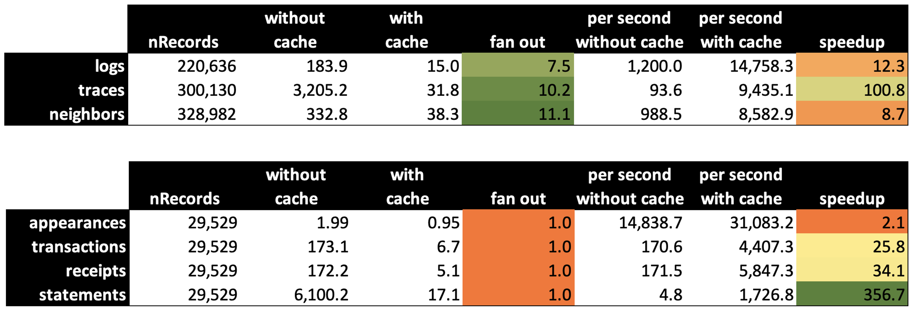

## Introduction

In this data exploration, we use TrueBlocks to extract "everything that ever happened" to a single address on Ethereum mainnet. The address we've chosen for this study is the GitCoin smart contracts called the `OSS Round 17 Implementation` address. This address has approcimately 30,000 transactions in its history.

We will use a tool called `chifra`, which is the TrueBlocks command line tool. TrueBlocks is an indexing and data extraction tool. In the following document, we intersperse ideas about why we built TrueBlocks the way we did as well as the data as a way to help you understand our view of decentralized data access.

## Getting Started

We won't spend time discussing installing TrueBlocks. [Here's an article](https://trueblocks.io/docs/install/install-core/) describing that if you need it. We assume you're properly installed. After installing, making sure to download the Unchained Index (https://trueblocks.io/docs/install/build-unchained-index/). Download the full index if you have space.

The article also assumes you're running your own local Ethereum node. You may use a remote node, such as Infura, but the difference in speed your get from your own locally-running node is very important, and it would be better if you had a locally-running node.

# Running Chifra

Assuming you're properly installed, run the following command:

```
chifra
```

You should get the following result:

```
Purpose:
  Access to all TrueBlocks tools (chifra <cmd> --help for more).

  Accounts:
    list          list every appearance of an address anywhere on the chain
    export        export full detail of transactions for one or more addresses
    monitors      add, remove, clean, and list address monitors
    names         query addresses or names of well known accounts
    abis          fetches the ABI for a smart contract
  Chain Data:
    blocks        retrieve one or more blocks from the chain or local cache
    transactions  retrieve one or more transactions from the chain or local cache
    receipts      retrieve receipts for the given transaction(s)
    logs          retrieve logs for the given transaction(s)
    traces        retrieve traces for the given transaction(s)
    when          find block(s) based on date, blockNum, timestamp, or 'special'
  Chain State:
    state         retrieve account balance(s) for one or more addresses at given block(s)
    tokens        retrieve token balance(s) for one or more addresses at given block(s)
  Admin:
    config        report on and edit the configuration of the TrueBlocks system
    status        report on the state of the internal binary caches
    daemon        initalize and control long-running processes such as the API and the scrapers
    scrape        scan the chain and update the TrueBlocks index of appearances
    chunks        manage, investigate, and display the Unchained Index
    init          initialize the TrueBlocks system by downloading from IPFS
  Other:
    explore       open a local or remote explorer for one or more addresses, blocks, or transactions
    slurp         fetch data from Etherscan for any address
  Flags:
    -h, --help    display this help screen

  Use "chifra [command] --help" for more information about a command.
```

Read through the above list. As you can see, there are a lot of things you can do with `chifra`. We're going to focus on three: `names`, `list` and `export`.

**chifra names**

The first command we're going to play with is `chifra names`. Enter this:

```
chifra names "round 17 implementation"
```

You should get a result similar to this:

```
tags            address                                     name
31-Gitcoin:Core	0x1b165fe4da6bc58ab8370ddc763d367d29f50ef0	Climate Round 17 Implementation
31-Gitcoin:Core	0xd95a1969c41112cee9a2c931e849bcef36a16f4c	Oss Round 17 Implementation
31-Gitcoin:Core	0xe575282b376e3c9886779a841a2510f1dd8c2ce4	Infra Round 17 Implementation
```

We're going to use the second of these two addresses. The one for `OSS Round 17 Implementation`. Enter this command next:

```
chifra list 0xd95a1969c41112cee9a2c931e849bcef36a16f4c
```

You should see a long list of `<blockNumber><tx_id>` pairs. These are the address's "appearances." This is every transaction in which the address appears for any reason on the chain. Given this list, you now have access to all the data associated with this address. Let's dig deeper.

## A Short Detour

Enter

```
chifra export --help
```

`chifra list` shows only the appearances. `chifra export` shows the actual transactional details. Notice that there are many different possibilities. Don't worry, we're going to spend a few minutes with each one.

## Getting Transactions

Enter

```
chifra export 0xd95a1969c41112cee9a2c931e849bcef36a16f4c --fmt json
```

You will see a very fast scrolling list of tons of data. See the schema described below to see the various fields in this data. Note that we can change the output format. `chifra` allows you to export to one of three formats: `txt`, `csv`, or `json`. Change the command to export CSV:

```
chifra export 0xd95a1969c41112cee9a2c931e849bcef36a16f4c --fmt csv
```

If this is the first time you've run this command, it takes a while. This is because, unlike traditional APIs, the data has not been extracted from its source before you ask for it. TrueBlocks works this way because one of its primary design objectives was to make sure it runs on small machines (such as the laptop I am using right now to write this article).

## Cacheing

While it is true that TrueBlocks extracts the data you request only when it's asked for, it is not true that it has to do this every time you query. TrueBlocks has a built in binary cache that speeds up subsequent queries. This speedup is quite significant as shown below. Enable to cache for any command by adding the `--cache` option, thus:

```
chifra export 0xd95a1969c41112cee9a2c931e849bcef36a16f4c --fmt csv --cache
```

We ran the above command on our computer with the word `time` in front of it (`time` chifra export...). The first run (without the cache) took 212.32 seconds to complete. That's 139 queries per second. This is how fast the node software's RPC is. Our code runs only as fast as the RPC. Except for the cache. The exact same command run from the cache takes 9.65 seconds. A speedup of over 22 times. See the table below for the speedups. **Upshot:** if you have the disc space, use the `--cache` option. The processing is much, much faster.



## Getting Logs


Let's try another command:

```
chifra export 0xd95a1969c41112cee9a2c931e849bcef36a16f4c --logs --fmt json --cache --output gitcoin-logs.json
```

This uses the same set of appearances as the previous commands but this time, we're exporting the logs created in these transactions. You'll notice that there are many more logs than there are transacitons. This is normal.

Notice, also that we export to JSON and are caching the results (although in this case, the data is already cached, so this redundant). Notice also the use of the `--output` option which allows you to redirect the data into a file. (You may do this with regular linux redirection as well.)


Let's add a little detail. Run this command:

```
chifra export 0xd95a1969c41112cee9a2c931e849bcef36a16f4c --logs --fmt json --cache --articulate --output gitcoin-logs-2.json
```

This is identical to the pervious command with the addition of the `--articulate` option. Do a diff of the two files to see what's changed. You'll see data such as this:

```
"articulatedLog": {
  "name": "RoundCreated",
  "inputs": {
    "ownedBy": "0xe46e...8097",
    "roundAddress": "0xd95a...6f4c",
    "roundImplementation": "0x3e7f...429e"
  }
}
```

See the `update.sh` script in this folder for more information about using `chifra`.

```
chifra export <address> --receipts --fmt csv
chifra export <address> --traces --cache_traces --fmt csv
chifra export <address> --accounting --statements --fmt csv
chifra export <address> --neighbors --fmt csv
```

## Schemas

Please see [./DATA_MODELS.md](this file) for information on each individual data model.

## Publishing

To be completed...

