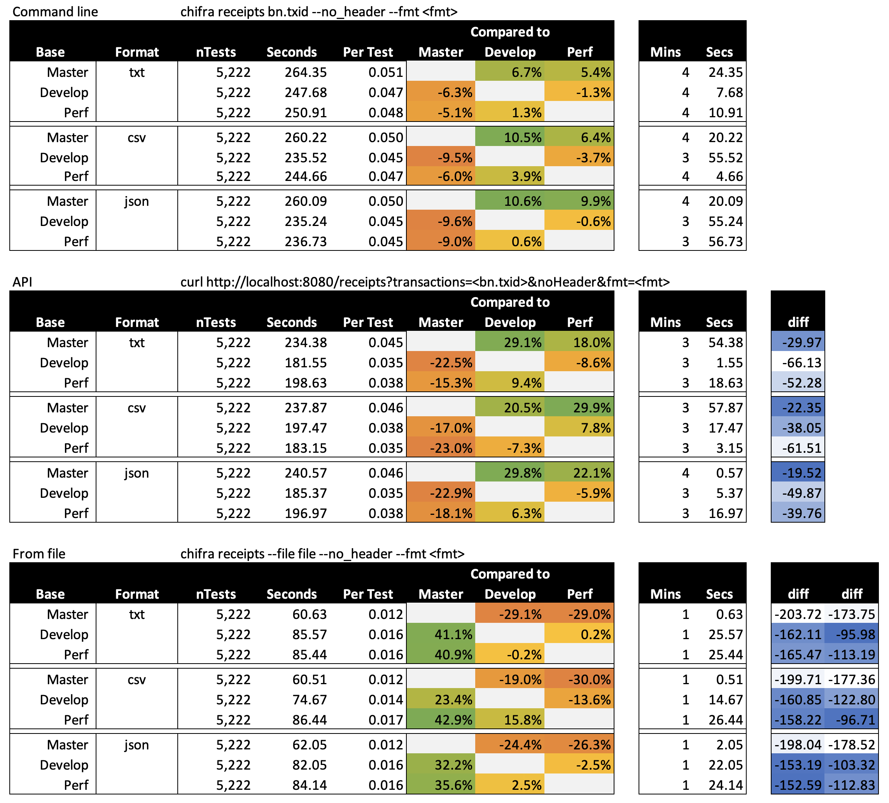

## Performance testing for chifra receipts

I created three executables:

- chifra-master
    - new chifra rendering code is disabled
- chifra-develop
    - new chifra rendering code is enabled
- chifra-perf
    - tests for better performance

### Shell Script

I generated a collection of shell scripts that call `chifra receipts` from the command line, the API, and rendining from a file visiting about 5,500 randomly-selected (but evenly-spaced) blocks.

I always queried the first transaction in the block. In some cases, there are no transactions, but this is okay, since it represents error cases.

This produced a collection of data files (in the `./results`) folder and produced the following timings. We ran the test against `txt`, `csv`, and `json` formatting.

### Anaylsis

My performance attempts were not as good as I thought they'd be. In fact, the CSV writer seems to be a bit faster. Plus, it's probably a fair bit more capeable.

Upshot: Use the CSV writer code.

The C++ `--file` option is nearly twice as fast as the GoLang from `--file` commands. (This was a surprising result.) There's a lot of room for improvement in the GoLang code particularly, I think, around the transaction identifier expansion code.

### Results

These are the results of the tests:

